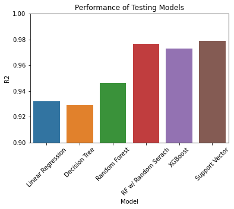
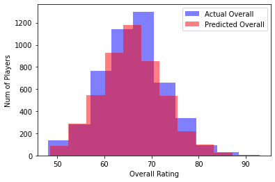

# FIFA Player Rating Prediction

## Overview
This project analyzes the FIFA players' data from EA FIFA 22 game. Based on the dataset, I’m building machine learning models to predict the player’s overall rating. 

## Business Problem
EA Sports FIFA game is the best-selling sports video game franchise in the world, localized into 18 languages and available in 51 countries. On May 10th, 2022, it was announced that EA and FIFA’s partnership is set to end after 30 years from July 2023. FIFA intends to enter a partnership with a new developer to produce the game that has the FIFA name.

My model’s purpose is to predict the players' overall rating based on their stats so that it can be implemented in the new game with FIFA's name on it.

## Data Understanding
The dataset (`fifa_players_22.csv`) was found in Kaggle, which was scrapped from sofifa.com. The data includes 19,000+ players with 110 columns of detailed player info & stats. 

The players' distribution by overall rating shows a normal distribution, where many players are rated within the 60 – 73 range. 

## Methods
This project uses various regression models to predict the overall rating for FIFA players. The baseline models have solid performance with high R2 and low RMSE. Therefore, I have used other models to increase the performance. 

 

Best Model: Support Vector Regressor (R2: 97.9 | RMSE: 0.986)

## Conclusions
Overall, the model’s performance is rock solid. Predictions were pretty on point against the actual overall rating for the players in above 80 & below 60 ratings due to lower population size. The prediction variance against the actual fluctuates near the center of player overall distribution (60 – 73 overall rating). 
